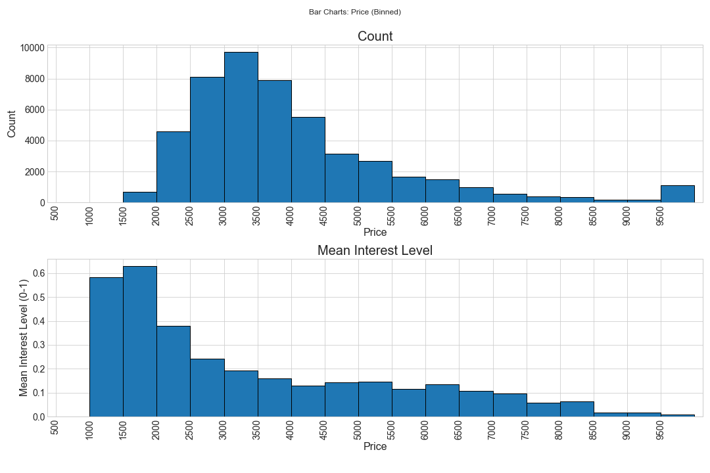
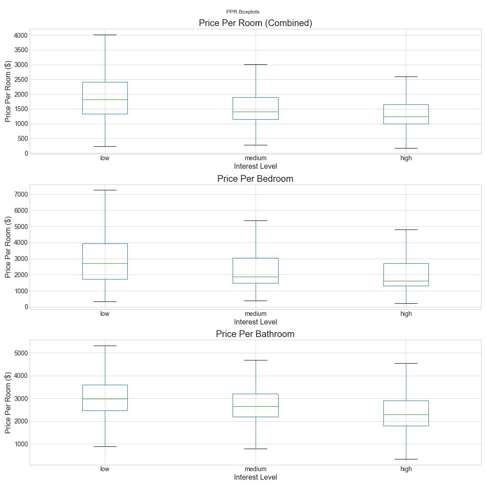
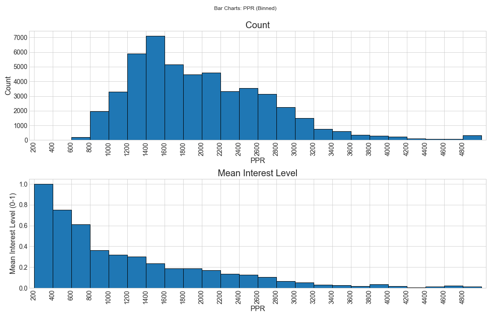
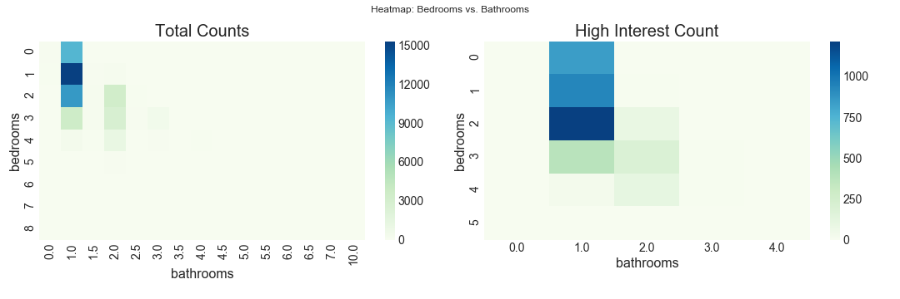
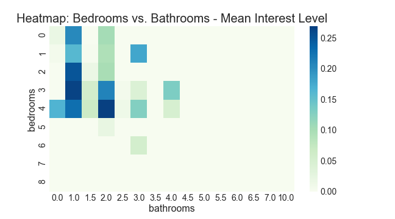
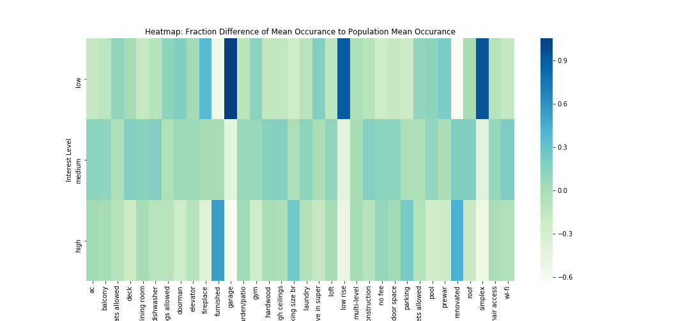
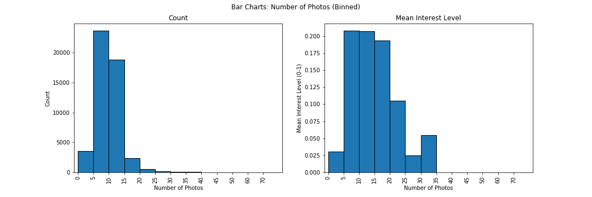
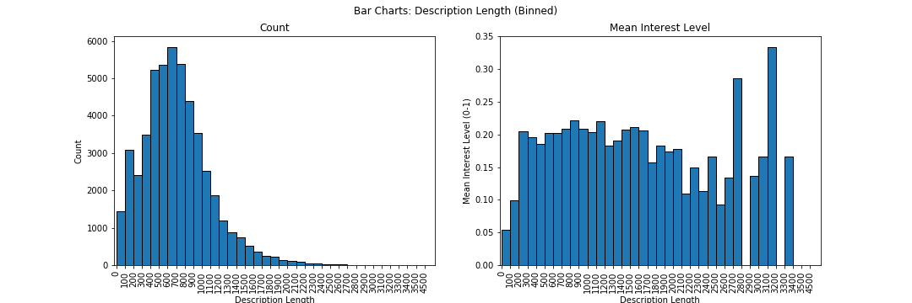
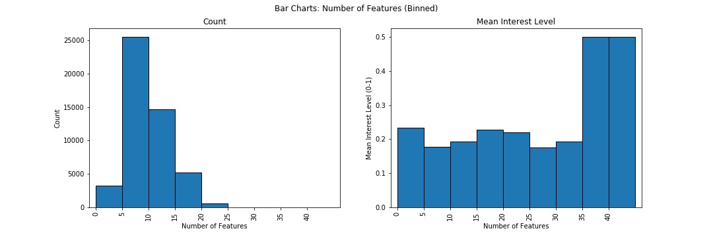

# NYC Rental Listing Data -  Full EDA

## Introduction

This project is inspired from the [NYC Rental Listing Kaggle challenge](https://www.kaggle.com/c/two-sigma-connect-rental-listing-inquiries). The original goal of the challenge was to develop a means of predicting interest level in new listings using the rental listing data provided by [RentHop](https://www.renthop.com/).

For the purposes of this project, however, we will simply be exploring the data and tring to try and provide a thorough investigation to the following question:
> **What are the key influencers of the interest level for a listing?**
 
As part of the [K2 Data Science](http://www.k2datascience.com/) curriculum, the focus of this data exploration will be on data cleaning, basic numerical and statistical analysis, and data visualization. This open-ended project should lay the foundation for future analysis in returning to Kaggle's original prompt of building a method for predicting interst level in a given rental listing.

This notebook will extend from the analysis and findings in the [MVP analysis](README_MVP.ipynb), conducting a more in-depth exploration of the possible influencers of interest level.

## Goals

The goal of this project is to expand upon the data exploration conducted in the MVP analysis through investigating the following attributes:
- Price (continued)
- Rooms
- Locations
- Features & other misc. attributes

This analysis should help lay the foundations for future work in building the a method of predicting interest level in new listings.

## Assumptions

The following assumption are made about the available data (post-cleaning):
- Dataset is accurate relfection of interest level proportions of actual NYC real estate market. It has been established in this dataset there is a low percentage high interest (7%), which will be accounted/compensated for in calculations
- Prices remaining after data cleaning are accurate, and reflect rent per month - not buy price.
- Listings remaining are all residential. Those with 0 bedrooms are studios, not commercial/retail.
- Listings remaining have accurate locations placing them within NYC - the area of interest.

As for the analysis conducted, it is important to note the following:
- High interest level is the focus of this analysis, but medium interest will not always be discarded entirely and usually given a slight weight when gauging things like mean interest level. Typically this will be the half-way point between whatever weight high and low are given. If a different approach is desired, said weight would need to be adjusted in the plots and calculations below.
- Higher priced properties (\> \$10,000) that were not removed during the data cleaning will still be included in analysis. Any outliers that occur from these select few instances will be noted and accounted for, when appropriate.
- Due to the skew in price data the application of normal statistics will be avoided, instead focusing on median and quartiles.

## Approach

Before conducting any data analysis, it was necessary to perform some basic cleaning of the data. This process was documented in the [MVP analysis](README - MVP Analysis.ipynb). In total, only 64 records out of the original 49,352 had to be removed due to inconsistencies/errors in price, location, and type of building (i.e. non-residential)

The Pandas, Matplotlib, and Seaborn packages were for plotting and heatmaps to help visualize areas of interest / correlation.

Often the overwhelming number of low interest properties drown out the visual indicators for high interest since they only comprise 8% of the data. To fix visualizations where this occurs, the occurances of each interest level are weighted by the inverse of their proportion to give the more rare occurance of a high interest listing the impact it deserves. Also will consider this 8% proportion for high interest level as benchmark for comparison to see if certain groupings exceed this expected proportion.

Since interest level exists as a categorical attribute ('low', 'medium', 'high'), in order to expand the possibilities of numerical analysis these levels were assigned integer values of [-1, 0, 1] and/or [0, 0.5, 1] for low, medium, and high interest levels, respectively. This is to enabled taking sums and means to gauge the balance of interest levels versus certain attributes like price, location, and features. Provides an additional means of benchmarking since we can compare results to see if a certain group exceeds mean interest level.

## Exploring Price (cont.)

(See [price/room analysis notebook](nyc_re_price_room_analysis.ipynb) for details)

With the addition of an integer value for interest level, it is possible to create a more continuous plot of changing interest level with increasing price. For the purpose of these charts, integer values of [0, 0.5, 1] have been chosen for low, medium, and high interest, respectively. The reasoning for this numbering convention is mostly to provide a indicator in the 0-1 range when taking mean interest levels for specific groupings. In the bar charts below, price has been split into \$500 intervals:

One can clearly observe a rapidly decreasing mean interest level as price increases beyond \$2,500. It is important to note that whilst the first two intervals show the highest mean interest level, they cannot be relied on too accurately due to the low number of records that fall in these ranges. Regardless, downward trend in interest level is still observed in the subsequent intervals - more data would simply be needed to extend certainty to the lowest priced listings.

As initially mentioned in the MVP analysis, price alone is likely not to capture the actual value of a residence. One would expect a property that is under-priced relative to similar properties to attract more interest. One possible method of capturing actual value is by the price per room. If summing both bedrooms and bathrooms, each bedroom constitutes 1 room, and each bathrom 0.5 rooms. Making a few assumptions about the general layout/structure of residences, a studio (listed as 0 bedrooms) should also be considered as having 1 room for said bedroom/living area, whereas any residence with 1 or more bedrooms specified is almost guaranteed to have at least 1 more room.

In calculating total room counts the resultings total price per room (PPR), said adjustments have been made. For price per bedroom, studios have simply been given the extra weight of actually having a bedroom versus having a total of 0. Plotting boxplots for PPR for total rooms, bedrooms, and bathrooms yields the following:

One can see a similar trend in decreasing price with increasing interest level, and comparing the medians to population medians for overall PPR yields:

| Interest Level | Median PPR | Difference from Pop. Median | % Difference |
|:-:|:-:|:-:|:-:|
| Low | \$1,818 | +\$151| +9% |
| Medium | \$1,399 | -\$268 | -16% |
| High | \$1,236 | -\$431 | -26% |

Comparing this to the origian results seen for regular price in the MVP analysis, the variation in price from the median is slightly more significant than price alone. In the case of high interest, the difference is 26% versus the original 24%.

This is not quite the level of improvement hoped for this new PPR value, but it possible that bedrooms alone might be more of the driving factor versus the sum of bedrooms and bathrooms. Repeating the same comparison for the bedroom PPR yields:

| Interest Level | Median PPR (Bedroom) | Difference from Pop. Median | % Difference |
|:-:|:-:|:-:|:-:|
| Low | \$2,700 | +\$252| +10% |
| Medium | \$1,880 | -\$568 | -23% |
| High | \$1,625 | -\$823 | -34% |

In this case, the percentage difference is significantly more than the original analysis of price alone. Between low and high interest there is a total difference of 44% relative to the population median PPR, whilst on the other hand comparing bathrooms alone (not shown) only showed 19% decrease in price. Thus, it is evident that bedrooms are more the driving factor in determining the value and subsequent interest level.

As a final analysis of PPR, the procedure above of splitting listings into intervals and observing mean interest level is repeated, using \$200 PPR intervals:

Whilst the same downard trend in interest level with increasing PPR is expected, what is more noteworthy is that said trend is much more consistent and smooth versus the original which plotted regular price. This agrees with the assumption that PPR more accurately captures the actual value of a rental.

## Exploring Number of Rooms

(See [price/room analysis notebook](nyc_re_price_room_analysis.ipynb) for details)

Having explored the connections between price per room and interest level, and discovering that the number of bedrooms in particular have a strong connection with interest level, the next obvious step is to analyze which room counts (disregarding price) show the highest levels of interest.

From the heatmaps above, one can see the majority of both overall and high interest listings fall in the 0-3 bedroom range. However, whilst total numbers of bedrooms and bathrooms extend to 8+, high interest listings reach no more than 5 bedrooms, 4 bathrooms. The overlap in the most popular region, however, demands additional analysis for discerning whether the presence of high interest listings is enough to outweigh the large number with low interest. One approach is to take a look at the mean interest level for each bedroom/bathroom combination:

The heatmap above utilizes interest level weights [0, 0.5, 1], resulting in means ranging from 0 to 1. With a population mean interest level of 0.19, the areas above that appear in darker blues are those which should be noted as showing higher interest than expected. The combinations of 2 bedrooms & 1 bathroom, and 3 bedrooms & 1 bathrooms are the two most signficiant results, which concurs with the regions where a relatively large number of high interest lisings were recorded. The 4 bedroom & 2 bathroom also shows high interest level relative to the population mean, but due to the absence of such listings in the higher interest level counts it is more a result of medium interest listings influencing the mean than a signficant amount of higher interest.

It is important to note again that with the interest level weights used, medium interest is given a positive influence on the mean. If this is not desired for subsequent work then these weights should be modified (e.g. [0, 0, 1])

## Exploring Location

(See [location analysis notebook](nyc_re_location_analysis.ipynb) for details)

Location is always touted as one of the most important factors in real estate. Consequently it only makes sense to investigate the potential correlation between location throughout NYC and the interest level. The most immediate step is to map out the occurance of listings at each interest level, which should provide insight as to whether there are any distinguishable areas with concentrations of different interest levels:

(*Note some maps may be slow to load*) 
[high interest map](maps/property_markers_ilevel_high.html) 
[medium interest map](maps/property_markers_ilevel_medium.html) 
[low interest map](maps/property_markers_ilevel_low.html) 
[combo interest map](maps/property_markers_ilevel_all.html)

In the high interest map there are clearly certain regions of concentrated high interest listings. However, also taking into consideration the medium and low interest it becomes evident that there needs to be a way of distinguishing regions in which there is a significant enough occurance of high interest such that it outweighs the general abundance of low interest listings. For example, it would be an error to assume a region is high interest due to an observed concentration, when in fact there a disproportionately high concentration of low interest listings in the same area.

One approach to this problem is to again give each type of interest level a weight, except this time help the rare occurances of high interest listings show by adjusting weights according to their expected probability. Thus, for example, with a weight of +1 and proportion of 7.8%, each high interest listing is weighed at 1/0.078 = ~12. Using a set of 2 different weights for low, medium, and high, the following maps were generated:

[heat map: weighted interest level v1](maps/hmap_weighted_ilvl.html) (low = -1, medium = 0, high = 1) 
[heat map: weighted interest level v2](maps/hmap_weighted_v2_ilvl.html) (low = -1, medium = 0.5, high = 1)

Both maps show distinct areas of higher interest levels, with the key disctintion being the second version shifts and amplifies certain areas with the presence of medium interest listings. The following areas show a significant proportion of higher interest, all of which located within Manhattan:
- Tribeca
- East Village
- Alphabet City
- Murray Hill
- Clinton
- Upper East Side
- Yorkville

All of the analysis of location thus far has been simply based off visual judgement, but more advanced approaches with numerical analysis are beyond the current scope of this project. For the most part, these would entail considering the direct vicinity of a given listing and how it compares to neighbouring listings. For example, one could compare a given listing with the following in the area:
- Average interest level
- Average price
- Average number of rooms

In order to ultimately provide a prediction tool which utlizes information about location, these aspects would need to be explored.

## Exploring Features

(See [feature analysis notebook](nyc_re_features_analysis.ipynb) for details)

having identified and tallied the features present using regular expressions, the top 20 features in terms of total counts were selected for analysis. Each listing was given a set of flags indicatiting whether each of these features was present, which allowed comparing the mean occurances of each feature across interest levels. In order to distinguish more easily between positive and negative leaning means, the percent different to the overall mean occurance for a given feature was deducted from each mean to yield the following heatmap:

The blue strips indicate a signficantly more frequent feature at the given interest level. Consequently, for high interest it is evident that 'furnished', 'king sized br', 'parking', and 'renovated' are all relatively common features. 

Conversely, 'fireplace','garage', 'low-rise', and 'simplex' are all very frequent with the low interest listings. In general, it seems that the more luxurious features available are typically tied to lower interest listings, which may in part be that they are not considered necessities or essentials, but may also tied the high price that one would expect to accompany them. This is probably most evident in the parallel between parking being a common feature in high interest versus garages in low interest; both fulfill the same, often crucial, function but are likely to come at significantly different costs.

Although the relationships may note be quite as significant, it may also be worth noting some of the lighter green hues. For high interest there is 'no fee', which again feeds back into the argument for reduced costs attracting customers. As for low interest, there is 'doorman', 'gym', and 'pool' which again consitute more luxurious additions versus necessities. 'live in super' is likely a less popular option due to privacy concerns, and 'pre-war' is essentially the antithesis to the popular feature 'renovated'. As someone who has struggled to find pet friendly rentals in the past, the slight signficance of 'pets allowed' (all variations) within the low interest is probably one of the more surprising outcomes. However, one explanation could be that for those without pets, the presence of pets may be a deterrent due to allergies, noise, smell, etc.

## Other Misc. Attributes

(See [feature analysis notebook](nyc_re_features_analysis.ipynb) for details)

There are still a few columns with valuable information which have not been explored yet: photos, and description.

Analyzing the quality or usefulness of the photos is beyond the current scope of this project, but rather than ignore that data entirely it is at least possible to see if the number of photos provided has any influence on interest level:

| Interest Level | % w/ Photos |
|:-:|:-:|
| Low | 90% |
| Medium | 99% |
| High | 99% |

From both the bar charts and percentages above, it is evident that the absence of and/or lack of a sufficient number of photos (in this case 5+) results in a significantly lower level of interest. Additionally, of the listings missing photos 95% are low interest, versus the 67% of those with photos (which is almost identical to the expected overall low interest proportion of 69%). Thus, it can be concluded that the absence of photos has a very strong influence of reducing interest levels, with listings ideally having 5+ photos in order to provide customers with sufficient details.

Analyzing description text itself is also beyond the scope of this project, but it possible to see if there is any correlation with the length of the description.

| Interest Level | % w/ Desc. |
|:-:|:-:|
| Low | 96% |
| Medium | 99% |
| High | 99% |

Whilst the overall percentage of low interest missing description is not quite as severe as with photos, we can again see that the lowest descriptions with less than 200 characters have a signficantly lower mean interest level. Additionally, of those missing descriptions 92% are low interest, versus the 68% low interest for those with descriptions. Consequently, whilst this analysis does not capture anything with regards to the actual content of the descriptions, a lack of description entirely has a clear connection with lower interest levels, and what is likely to be a less detailed description with fewer characters will also have reduced interest. Conversely, though, there seems to be little gain in interest level by increasing description lengths past 200 characters (ignoring the two sharp bars which do not have many listings for an accurate average).

The above procedures can also be repeated for features to see if the number of features has any impact on interest level:

| Interest Level | % w/ Features |
|:-:|:-:|
| Low | 94% |
| Medium | 93% |
| High | 90% |

Contrary to photos and description, the number of or presence of features in a listing seems to have little overall impact on the interest level. In fact, a smaller fraction of high interest listings even have features listed. One possibility is that the presence of features typically comes with higher costs, since many features will constitute more luxurious extras versus necessities. Additionally, it is worth noting that of the 3,120 listings missing features, only 58 are also missing description. It is very possible that the features of a given listing are captured within the descriptions, still providing customers with the information they desire, albeit in a non-traditional method.

## Summary & Conclusions

In summary of the analysis conducted, the following relationships with (high) interest level were discovered/confirmed:
1. On average, lower priced listings have higher interest. However, a more thorough analysis may need to be conducted to truly confirm the lowest price ranges since the amount of data in these ranges was lacking.
2. On average, lower PPR (price per room) listings have higher interest. Specifically, the number of bedrooms relative to the price was the key driving factor in interest level.
3. Key Combinations of Bedroom and Bathroom had higher levels of interest, with the 2-3 bedrooms and 1 bathroom showing the most success. High interest listings are practically non-existent beyond 4 bedrooms.
4. Key locations/areas throughout the city show concentrations of high interest level: Tribeca, East Village, Alphabet City, Murray Hill, Clinton, Upper East Side, Yorkville.
4. Certain key features are significantly more prevalent with high interest listings: 'furnished', 'parking', 'renovated', and 'king sized bed'. Other key features are somewhat more prevalent with high interest listings: 'no fee'.
5. Certain key features are prevalent with low interest listings: 'garage', 'low-rise', 'simplex', 'fireplace'. Other key features are somewhat more prevalent with high interest listings: 'pool', 'doorman', 'gym', 'live in super', 'pre-war', 'pets/cats/dogs allowed'.
6. No photos or very few photos (\<5) are very likely to result in low interest.
7. No description or very short descriptions (\< 200 characters) are very likely to result in low interest.

Based off the findings above, in building a prediction method for interest level, price, PPR, number of bedrooms, bed to bath ratio, features (those identified), number of photos, and length of description would all be suitable variables to consider at this point. Location also appears be of significance based of the maps produced, but in order to make use of location additional analysis is required to provide more numerical measuremets.

## Next Steps

The most obvious next step is to begin building a prediction method for the interest levels of new listings. However, although the number of variables have already been identifed there are still several avenues which warrant a more in-depth analysis.

As mentioned earlier, location data was not analyzed beyond a purely visual representation. Performing clustering on location data in order to evaluate the following potential influencers of interest level with a more numerical approach:
- Difference in price/PPR between listing and area.
- Difference in number of rooms/room ratio in the listing and its area.
- Differene in features in the listing and its area
- Mean interest level in the area

Additionally, the street names were not discussed or analyzed as part of this investigation, which will ultimately require a significant amount of cleaning in order to identify high interest streets/addresses.

Finally, expanding this research beyond the provided dataset may provide new factors have yet to be considered. Some possibilities include:
- Access to schools
- Access to public transport
- Access to health services
- Average income in the area
- Area demographics
