# Classification Project: Lending Club

### Introduction

Lending Club is an online platform for connecting investors and borrowers, both for individuals and businesses. From an investors standpoint, the challenge arises in accurately identifying which loan applications are "safe" investments in which the borrower is less likely to default. For the purposes of this project, we will attempt to model off of past loan application along with their ultimate loan status to address the following challenge:

<b> Using the Lending Club data available, can we predict which loans will default? </b>

This leads to a classic classification problem of separating default loans from non-default loans, with the business goal of providing investors with "safe" opportunities based off what can be learned from the available data.

### The Data

The data used for this analysis was obtained from a past dataset posted on [Kaggle](https://www.kaggle.com/wendykan/lending-club-loan-data). Without delving into data exploration, the following information is provided for this dataset:

- Loan data for the years 2007-2015
- 887,383 rows
- 75 columns (including index)

Included with the dataset is a data dictionary which gives a brief insight into the meanin of each column/feature. There are some discrepancies between what was seen in this dictionary versus which columns actually existed, but matching up definitions with what this dataset actually has yields the following:

##### Borrower Info
- addr_state: The state provided by the borrower in the loan application (categorical: 2 char state code)
- annual_inc: The self-reported annual income provided by the borrower during registration (numeric)
- annual_inc_joint: The combined self-reported annual income provided by the co-borrowers during registration (numeric)
- emp_length: Employment length in years (categorical: ['< 1 year', '1 year', '2 years', '3 years', '4 years', '5 years', '6 years', '7 years', '8 years' , '9 years', '10+ years'])
- emp_title: The job title supplied by the Borrower when applying for the loan (text)
- home_ownership: The home ownership status provided by the borrower during registration. (categorical: ['RENT', 'OWN', 'MORTGAGE', 'OTHER'])
- verification_status: Indicates if income was verified by LC, not verified, or if the income source was verified (categorical: ['Verified', 'Source Verified', 'Not Verified'])
- member_id: A unique LC assigned Id for the borrower member (numeric)
- verification_status_joint: Indicates if the co-borrowers' joint income was verified by LC, not verified, or if the income source was verified (categorical: ['NaN', 'Verified', 'Source Verified', 'Not Verified'])
- zip_code: The first 3 numbers of the zip code provided by the borrower in the loan application (categorical/text)

##### Loan Info
- application_type: Indicates whether the loan is an individual application or a joint application with two co-borrowers (categorical: ['INDIVIDUAL', 'JOINT'])
- collection_recovery_fee: Post charge off collection fee (numeric)
- desc: Loan description provided by the borrower (text)
- grade: LC assigned loan grade (categorical: ['A',' B', 'C', 'D', 'E', 'F', 'G'])
- id: A unique LC assigned ID for the loan listing (numeric)
- initial_list_status: The initial listing status of the loan (categorical: ['W', 'F'])
- issue_d: The month which the loan was funded (date)
- last_credit_pull_d: The most recent month LC pulled credit for this loan (date)
- loan_status: Current status of the loan (categorical: ['Fully Paid', 'Charged Off', 'Current', 'Default', 'Late (31-120 days)', 'In Grace Period', 'Late (16-30 days)', 'Does not meet the credit policy. Status:Fully Paid', 'Does not meet the credit policy. Status:Charged Off', 'Issued'])
- policy_code: publicly available policy_code=1; new products not publicly available policy_code=2 (categorical: ['1', '2'])
- purpose: A category provided by the borrower for the loan request (categorical: ['credit_card', 'car', 'small_business', 'other', 'wedding', 'debt_consolidation', 'home_improvement', 'major_purchase', 'medical', 'moving', 'vacation', 'house', 'renewable_energy', 'educational'])
- sub_grade: LC assigned loan subgrade (categorical: ['A1', 'A2', ..., 'G4', 'G5'])
- title: The loan title provided by the borrower (text)
- url: URL for the LC page with listing data (text)

##### Loan Finances
- funded_amnt: The total amount committed to that loan at that point in time (numeric)
- funded_amnt_inv: The total amount committed by investors for that loan at that point in time. (numeric)
- installment: The monthly payment owed by the borrower if the loan originates (numeric)
- int_rate:	Interest Rate on the loan (numeric)
- last_pymnt_amnt: Last total payment amount received (numeric)
- last_pymnt_d:	Last month payment was received (date)
- loan_amnt: The listed amount of the loan applied for by the borrower. If at some point in time, the credit department reduces the loan amount, then it will be reflected in this value (numeric)
- next_pymnt_d:	Next scheduled payment date (date)
- out_prncp: Remaining outstanding principal for total amount funded (numeric)
- out_prncp_inv: Remaining outstanding principal for portion of total amount funded by investors (numeric)
- pymnt_plan: Indicates if a payment plan has been put in place for the loan (categorical: ['y', 'n'])
- recoveries: post charge-off gross recovery (numeric)
- term: The number of payments on the loan. Values are in months and can be either 36 or 60 (categorical: ['36', '60'])
- total_pymnt: Payments received to date for total amount funded (numeric)
- total_pymnt_inv: Payments received to date for portion of total amount funded by investors (numeric)
- total_rec_int: Interest received to date (numeric)
- total_rec_late_fee: Late fees received to date (numeric)
- total_rec_prncp: Principal received to date (numeric)

##### Borrower Credit History
- collections_12_mths_ex_med: Number of collections in 12 months excluding medical collections (numeric)
- delinq_2yrs: The number of 30+ days past-due incidences of delinquency in the borrower's credit file for the past 2 years (numeric)
- dti: A ratio calculated using the borrower’s total monthly debt payments on the total debt obligations, excluding mortgage  and the requested LC loan, divided by the borrower’s self-reported monthly income. (numeric)
- dti_joint: A ratio calculated using the co-borrowers' total monthly payments on the total debt obligations, excluding mortgages and the requested LC loan, divided by the co-borrowers' combined self-reported monthly income (numeric)
- earliest_cr_line:	The month the borrower's earliest reported credit line was opened (date)
- fico_range_high: The upper boundary range the borrower’s FICO at loan origination belongs to (MISSING)
- fico_range_low: The lower boundary range the borrower’s FICO at loan origination belongs to (MISSING)
- inq_last_6mths: The number of inquiries in past 6 months (excluding auto and mortgage inquiries) (numeric)
- last_fico_range_high	The upper boundary range the borrower’s last FICO pulled belongs to (MISSING)
- last_fico_range_low	The lower boundary range the borrower’s last FICO pulled belongs to (MISSING)
- mths_since_last_delinq: The number of months since the borrower's last delinquency (numeric)
- mths_since_last_major_derog: Months since most recent 90-day or worse rating (numeric)
- mths_since_last_record: The number of months since the last public record (numeric)
- open_acc:	The number of open credit lines in the borrower's credit file. (numeric)
- pub_rec: Number of derogatory public records (numeric)
- revol_bal: Total credit revolving balance (numeric)
- revol_util: Revolving line utilization rate, or the amount of credit the borrower is using relative to all available revolving credit (numeric)
- total_acc: The total number of credit lines currently in the borrower's credit file (numeric)
- open_acc_6m: Number of open trades in last 6 months (numeric)
- open_il_6m: Number of currently active installment trades (numeric)
- open_il_12m: Number of installment accounts opened in past 12 months (numeric)
- open_il_24m: Number of installment accounts opened in past 24 months (numeric)
- mths_since_rcnt_il: Months since most recent installment accounts opened (numeric)
- total_bal_il:	Total current balance of all installment accounts (numeric)
- il_util: Ratio of total current balance to high credit/credit limit on all install acct (numeric)
- open_rv_12m: Number of revolving trades opened in past 12 months (numeric)
- open_rv_24m: Number of revolving trades opened in past 24 months (numeric)
- max_bal_bc: Maximum current balance owed on all revolving accounts (numeric)
- all_util: Balance to credit limit on all trades (numeric)
- total_rev_hi_lim:	Total revolving high credit/credit limit (numeric)
- inq_fi: Number of personal finance inquiries (numeric)
- total_cu_tl: Number of finance trades (numeric)
- inq_last_12m:	Number of credit inquiries in past 12 months (numeric)
- acc_now_delinq: The number of accounts on which the borrower is now delinquent (numeric)
- tot_coll_amt: Total collection amounts ever owed (numeric)
- tot_cur_bal: Total current balance of all accounts (numeric)

This is clearly a lot of features to grasp, but hopefully with thorough data exploration and cleaning we can drastically reduce the set of features off which we model. Either way, with both this signficant set of features and the 800k+ rows of data, performance is expected to become a signficiant limiting factor on the extent to which models we can explore and how much tuning is feasible.

It is also worth noting that a number of features have been marked as "MISSING", which are features that were listed in the data dictionary but not actually present in the dataset. Whilst this does appear to be limited to just FICO scores, it is unfortunate that this data is absent as one would expect those values to provide a valuable indicator for the risk of loans.

### Exploratory Data Analysis

<i> See [EDA notebook](./notebooks/1_0__EDA.ipynb) for additional details</i>

Before delving into individual attributes, we will take a quick look at the overall completenes of our dataset. Using the missingno python package we can generate a matrix visualization of missing data:

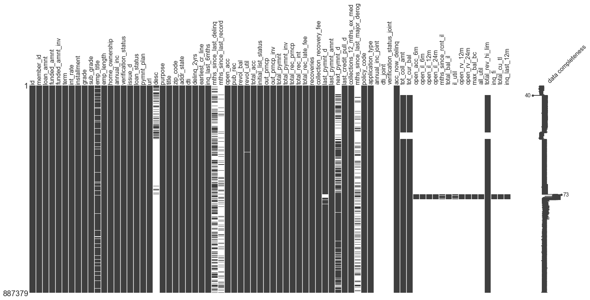

It is immediately evident that there are significant portions of data missing, with numerous columns appearing to be almost entirely devoid of values. The nature of these absences will need to be explored and dealth with during data cleaning, but for the time being the following key observations can be made:
- Almost all columns pertaining to installment accounts (e.g. 'open_il_6m') are missing data for most records with the expection of a small subset for which all values are present. The connection between these records should be investigated in order to determine why these records have values versus the rest of our data.
- The 'joint' columns appear to be entirely blank, likely only having a few select records. Considering the 'application_type' column seems to be fully populated, which should be  what distinguishes between 'INDIVIDUAL' and 'JOINT' records, it is likely we have very few loans of type 'JOINT' which render the additional joint columns irrelevant.
- Columns involving "months since..." are missing a significant proportion of values. Considering the time-sensitive nature of these values, this could be a result of older loans information expiring or no longer being updated. The potential time dependency of these values needs to be investigated, since it raises concerns about how data is updated and maintained throughout the years. For example, if applicant history, income, etc. are all still updated past the point of a loan reaching completion, then all such data becomes useless since we are trying to evaluate loans with information we would have at the time of their creation.
- Description is the last column which can easily be identified as missing signficiant portions of data. This is likely a result of this field being optional and/or inconsistently populated. However, this is less concerning than our other columns since with the anticipated amount of variability in these descriptions it is unlikely this attribute will be of much use.

##### Loan Status

Moving on to indivdual attributes, the key focus of this analysis is the loan status - specifically distinguishing between default and non-default loans for the purpose of classification. Taking a look at the distribution of loans across each status yields the following:

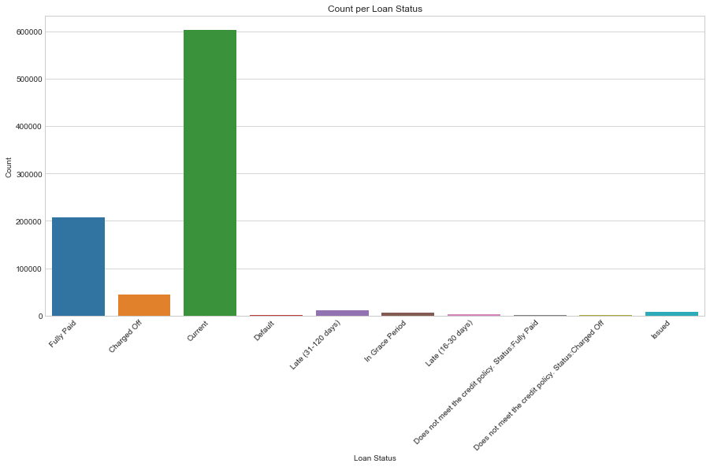

Immediately we see that the majority of loans in our dataset have a status of "Current". Unfortunately, since we are interested in classifying loans with a definite status of default or non-default, we need to disregard all loans which have yet to be concluded. This also includes loans with statuses of "Issued", "Late (...)", and "In Grade Period". In total, this constitutes just over 70% of our available data! Luckily, we started with a dataset of over 800,000 records, so removing all forms of current loans still leaves us with 250,000+ records. This should hopefully still be more than sufficient for our modelling, and at very least helps alleviate some of the concerns with model performance by bringing our dataset to a more manageable size.

Continuing on with our new set of loans and loan statuses:

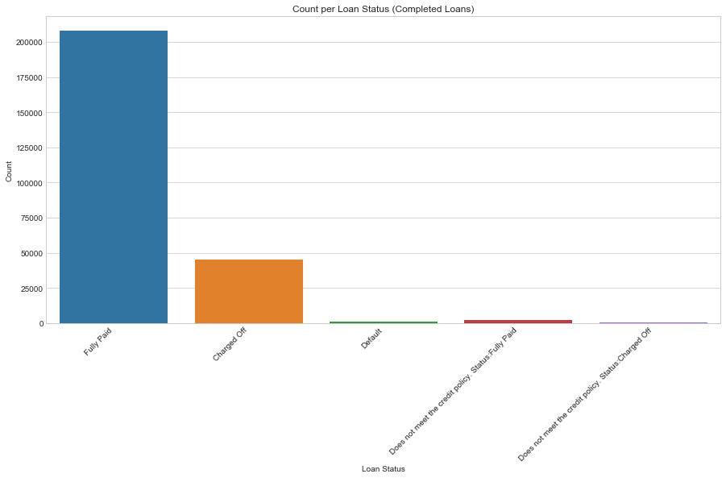

For the purposes of our classification problem, we need to reduce the above statuses into the categories of 'default' and 'non-default'/'fully paid'. The only real uncertainty in this arises in how to handle the two out-of-policy (OOP) statuses. Considering their small proportion, we will disregard the notion of OOP loans and simply group these in with their respective fully paid/charged off statuses. Proceeding with the conversion of loans statuses, treating default as positive (1) and non-default/paid as negative (0), this leads us to the following distribution:

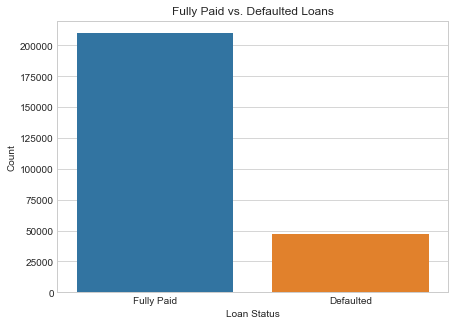

If it was not obvious already, we can clearly see that defaulted loans are actually somewhat of infrequent occurance. Specifically, only about 18% of our total loans are defaulted. This class imbalance will almost certainly pose challanges in accurately picking out the "rare" default loans without falsely identifying a number of good loans (i.e. false positives) in the process. Appropriate measures will need to be taken in order to remedy this class imbalance as best as possible.

##### Income

With default status established, we can now proceed to analyze other attributes for possible correlations. Income is one of the first attributes one might anticipate having an impact on the likeliness of a loan defaulting. Unfortunately, the distribution of incomes in this dataset is extremely skewed to the right, due to a number of outlier income values reaching a maximum of 8 million. Whilst the most extreme outliers are likely best removed from our analysis during data cleaning, we still would likely benefit from an alternative scale to income. There area number of options one could explore, such as the root or log, but for the initial purpose of data explortion we will simply bin incomes into 10th quantiles:

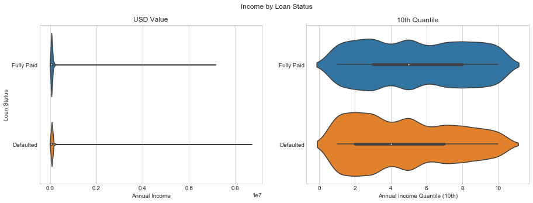

As one can see above, the quantile view on the right provides a much smoother visualization of loan tendencies across income levels. The potential connections between default rates and income levels may not be as significant as expected, but one can still observe an increase in the proportion of defaulted loans at the low income end of the spectrum, whereas fully paid loans show more of a uniform distribution.

##### Loan Amount

Proceeding to the loan amount, one would expect a connection between the magnitude of loans and the applicant's income. In the interst of both the lender and the borrower, loans should ideally only be given to applicants with the ability and security (i.e. income) to pay back the loan. Performing a hex bin joint plot between income and loan amount yields the following:

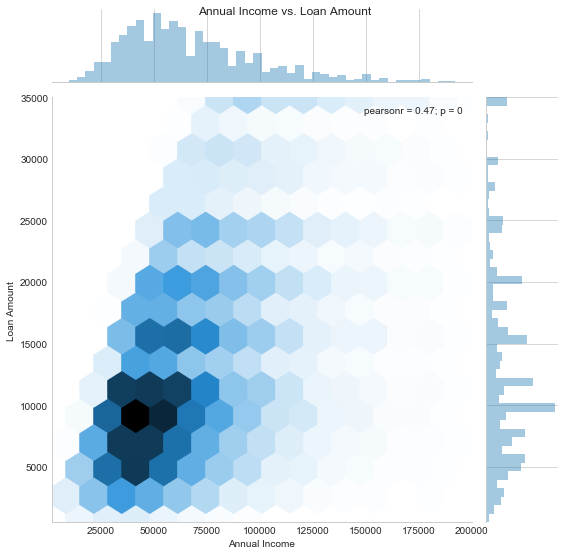

One can note a general sloped cut-off on the left side, which confirms some form of barrier or limit in the loan amount that can be requested and/or approved for a given income. Also worth noting, is that all loans do not exceed an amount of $35,000, which can be tied to Lending Club's limit on loan amounts in the context of loans for individuals (vs. institutions).

Drawing inspiration from the attribute of Debt to Income ratio (DTI) present in our dataset, a more informative perspective of loan amounts in the context of default rates may come from considering the proportion of the loan amount to income. Defining loan to income ratio (LTI) as the loan amount over the applicant's annual income, we can see the following distributions between loan statuses:

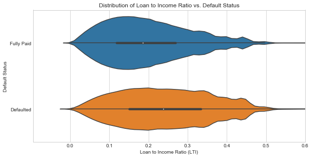

Generally, higher LTI loans seem to be a more infrequent occurance, but one can note that defaulted loans show both a larger proportion of high LTI loans and a distribution centered around a higher LTI versus the fully paid loans. Consquently, utilizing this LTI ratio may prove a promising custom feature worth exploring during feature selection and engineering

##### Grade

The loan grade assigned by Lending Club should hopefully carry some weight in indicating which loans are low/high risk. Looking at the distributions of loans across grades reveals that the majority of loans are classified with a grade of A through C, whereas the lower scores of D through G are relatively infrequent:

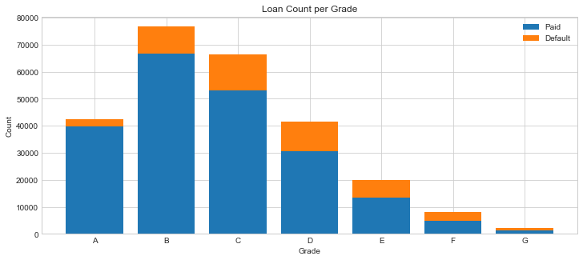

Due to the total number of loans with grade A through C, we see the largest quantity of defaulted in these categories - even A grade loans are not exempt from the possibilty of default. However, a more accurate depiction of the risk associated with each grade should come from looking at the rate of defaulted loans in each category:

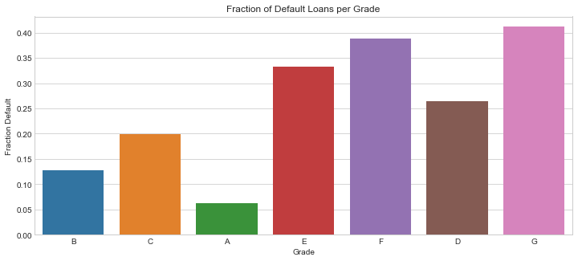

As one can see above, with decreasing grade the rate of defaulted loans consistently increases. It is worth noting that with the more limited number of loans in grades E through G, whilst the default rates appear to reflect the expected trend, there may be challenges in obtaining accurate statistics since there is a higher likelihood for biased samples in these lower grades.

Breaking down the above chart into subbgrades:

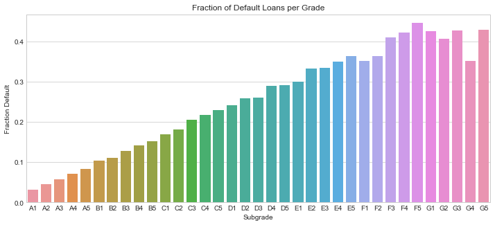

It would appear this linear trend default rate versus grade is even smoother at the more granular subgrade. Additionally, the transition between the lowest and highest grades in neighbouring parent grade categories does not show a significant jump relative to transitions between prior subgrades. We do, however, begin to see some volatility in the trend of default rates beginning with the grade F. This is very likely a result of the more limited sets of data for F and G, as mentioned earlier.

##### Other Key Take-Aways

Delving into each and every attribute for this report would be an excess of information, but here are some of other key observations made throughout EDA:

- <b>Interest Rate</b>: interest rates appear to be directly tied to loan subgrades, with very little variation in interest rates for loans of the same subgrade at a give month/year. Across the months and years, however, these assigned interest rates fluctuate. Thus, if fair comparisons are to be made between interest rates in older and newer loans, some adjustments should be made to account for these variations.
- <b>Employment Length</b>: default rates across the various employment lengths (ranging from 0-10+ years) actually appears to be fairly uniform with an approx. 0.18 rate in line with the default rate of the entire dataset. The 'N/A' category, however, shows a much higher rate of approx. 0.26.
- <b>Loan Purpose</b>: the vast majority of loan applications fall under the category of 'Debt Consolidation', followed by 'Credit Card', whilst the remaining purposes appear rather scarce. Either way, default rates across purposes show some fluctuation, with 'Car', 'Wedding', and 'Major Purchase' falling in the lower 0.12-0.15 range, and a signficant peak in 'Small Business' loans with a rate of approx. 0.29.

The exploration of other attributes and accompanying figures can be found in the EDA notebook (albeit in a less presentable format).

### Data Cleaning

<i> See [data cleaning notebook](./notebooks/2_1__Data_Preparation__Cleaning.ipynb) for additional details</i>

As identified earlier during EDA, there are signficiant portions of data missing which need to be addressed. Depending on the circumstance, this can be solved either by imputing, reducing the column data to a simpler form, or eliminating the data entirely. Given the number of attributes with null data amounts to 32 columns, this process was split into procedurally tackling numerical, categorical, date, and text values.

##### Numercial Attribute Cleaning

The following procedures were taken to fix and/or eliminate null numerical data:

- <b>[mths_since_last_delinq, mths_since_last_major_derog, mths_since_last_record, delinq_2yrs]</b>: As noted earlier during EDA, there appeared to be a lot of missing values in many of the "months since..." attributes. In the case of measuring time since the last negative credit event, such as a delinquency, we make the assumption that a missing value implies there is no such occurance on record. Conseuently, for the sake of consistency these attributes are reduced to a simple binary feature (e.g. 'had_delinq') indicating whether or not there was a history of a delinquency, major derog., or record. Additionally, the 'delinq_2yrs' column can be combined into this definition for the delinquency column.
- <b>[total_rev_hi_lim, tot_coll_amt, tot_cur_bal]</b>: The missing data in these columns was actually established as being tied to records instantiated past midway through 2014. One can infer that these fields were newer additions to the dataset, so the option becomes whether to discard these features or discard the older records. Due to our large dataset (now approx. 250,000 records with current loans removed), we should still be able to afford losing the older records which constitute about 8% of our relevant data. Considering the concerns for both performance and the time sensitivity / expiration of certain attributes mentioned earlier, we will opt for removing the older records and keeping these fields.

##### Categorical Attribute Cleaning

The only categorical attribute with null values is 'verification_status_joint'. As noted earlier during EDA, there appeared to be a negligible proportion of loans of application type 'JOINT', for which these joint attributes were populated. Upon closer inspection it turns out only 2 records within our relevant data were of this type, rendering application type and all related joint columns useless for our modeling. Consequently, these columns were all removed.

##### Date Attribute Cleaning

With many of the date attributes we encounter the issue of having information on hand that we would not have knowledge of or are not relevant at the time a loan is instantiated, which is when our models will be trying to predict the ultimate outcome. Last and next payment dates can be immedatiately identified as such and are consequently discarded.

Other date features, however, require additional investigation:

- <b>[earliest_cr_line]</b>: One would assume that all loan applications would require a record of credit prior to the time the loan is issued ('issue_d'). Fortunately, all records have a earliest credit line date prior to the issue date, so there is little reason for concern in utilizing this attribute.
- <b>[last_cr_pull_d]</b>: The last credit pull date runs the risk of being continuously updated past the point of a loan being issued. Comparing this date with the issue date reveals that 99% of data has an updated credit pull date past the issue date, so this column no longer represents data as it was at the time of loan instantiation and must be discarded.

##### Text Attribute Cleaning

We already know from our initial view of null data that the text columns 'emp_title' and 'desc' have significant portions of missing values. Additionally, taking a look at exact null counts we see that 'title' is also missing around 130 values.

- <b>[emp_title]</b>: Looking at the values present for employment title, it is evident that there is little to no consistency or regulation in how this field is populated. Differences in phrasing, spelling, etc. mean that extracting useful information from this column would involve an level of parsing realistically beyond the scope of this analysis. Consequently, this column will be discarded.
- <b>[desc]</b>: Following the same reasoning as with employment_title, the effort for extracting useful information from this column is not worth the return and so this column will discarded.
- <b>[title]</b>: Inspecting the values for this title field reveals this to be the loan purpose, as defined by the applicant. Not only do we already have a concise 'purpose' column, but these values suffer from the same incosistencies seen in the previous two text columns. Consequently, we will defer to using the categorical 'purpose' attribute and discard this title column.

##### General Data Cleaning

Beyond these major issues addressed above, the following general cleaning was performed:

- Records with null values in the remaining columns of interest were dropped
- Major outliers (typically beyond the 99.9th) percentile were removed

### Feature Engineering

<i> See [data preparation/feature engineering notebook](./notebooks/2_1__Data_Preparation__Feature_Engineering.ipynb) for additional details</i>

##### Target Variable

As discussed during EDA, the existing loan status column needs to be translated into an equivelent default/non-default classification. A new column is created to capture this binary classification:
- <b>[default]</b>: Value of 0 or 1 assigned depending on loan status. Disregarding current loans, all permutations of loans with status of 'Default' or 'Charged Off' are marked as positive (1).

##### New Features

New features were created to either translate certain categorical features into more compact numerical equivalents (reducing dimensionality), or to offer new/alternative measures which may provide stronger predictors for modelling:
- <b>[grade_value, subgrade_value]</b>: A scaling system to convert letter grades into a numerical equivalent. Grade values range from 0-6 for A-G. Subgrade values are calculated similarly, but with letter grades denoting the tens place, and sub numerical grades denoting the units. For example, A1 becomes a score 1, C3 a score of 23.
- <b>[grade_p_value, subgrade_p_value]</b>: Instead of defining a somewhat arbitrary scale, an alternative approch to weighing the numerical scores of each grade is to take into account the proportion of default loans in each grade. Each loan grade subsequently gets assigned the percentage of default loans (ranging 0.0-1.0). Since this value depends on dataset statistics, it needs to be recalculated for each potential training set.
- <b>[emp_length_val]</b>: To reduce the number of categorical OHE features, employment length will be converted to a numerical scale. This is a fairly straightforward 1:1 conversion, with the only exceptions being '10+ years', '\<1 year' and 'N/A'. The first two will simply be treated as 10 and 0, respectively. N/A will be assumed to indicate unemployment, and given a value of -1 to fall in line with the rest of the scale.
- <b>[lti, iti, rbti, tbti]</b>: Similar to Debt to Income (DTI), other ratios may prove useful additions to our models. Income ratios are calculated for loan amount (LTI), installment (ITI), revolving balance (RBTI), and total balance (TBTI). Feature selection processes should ultimately choose the strongest indicator.
- <b>[int_rate_delta]</b>: As mentioned during EDA, interest rates seem to have a fixed connection with the loan subgrade, but fluctuate as adjustments are made over time. Capturing the difference of a interest rate at a given point in time with the population mean for that subgrades interest rate over all recorded data may provide a useful indicator for capturing the relative risk (i.e. state of the economy) at the time the loan is issued.
- <b>[earliest_cr_line_td]</b>: The earliest credit line dates on their own do not provide much use due, but taking into account the difference between this date and the issue date captures the age of a borrowers credit history. This new feature is consequently just the numerical time delta (in days) between the earliest credit line date and the issue date.

###### Simplified Features

A few attributes could benefit from being simplified in terms of reducing the set of categories or converting 2 category items to binary features:

- ['term_bin']: Since term only has two values (36 vs. 60 months), this attribute can simply be converted to a binary feature indicating whether a loan is 36 months (0) or 60 months (1).
- ['home_ownership']: Only 1 record has a value of 'ANY' so this category is re-written as 'OTHER'.
- ['verified']: The three categories for 'verification_status' ('Verified', 'Source Verified', and 'Not Verified') are reduced to a simple binary feature indicating verified (1) or not verified (0). 

##### Scaled Features

Noting many of the of right-skewed distributions observed during EDA (e.g annual income), it is possible that scaled features may provide a more balanced perspective without the need to discard too many of the high-end outliers. For each of attribute observed to have a significant proportion of high outliers, scaling via square root, log, and 10th quantiles was performed. For each attribute, only one should be selected for modelling, so the best feature in each set (including the original, unscaled version) was selected via f-test. The results were as follows:

- <b>annual_inc</b>: ['annual_inc_q10'] (10th quantile)
- <b>revol_bal</b>: ['revol_bal_log'] (log)
- <b>revol_util</b>: ['revol_util'] (original)
- <b>tot_cur_bal</b>: ['tot_cur_bal'] (original)
- <b>tot_coll_amt</b>: ['tot_coll_amt'] (original)
- <b>total_rev_hi_lim</b>: ['rev_lim_sqrt'] (square root)
- <b>funded_amnt</b>: ['funded_amnt_q10'] (10th quantile)
- <b>earliest_cr_line_td</b>: ['cr_line_td_log'] (log)

All other versions of these feature will be disregarded during modelling. Additionally, we need to perform the same selection process for our grade/subgrade values, since all 4 capture the same property with similar scale. Performing select K best again with the f-test yields:

- <b>grade value</b>: ['subgrade_p_value'] (% default per subgrade)

The remaining versions of grade and subgrade will be disregarded in our models.

##### Eliminating Highly Correlated Features

The process above has already addressed the redundancies we introduced via our new features, but there is still the possibility for strong correlations between some of the original attributes present in the data set. Using a correlation cut off in the range of 0.6-0.8, analyzing the correlation matrix via heatmap brought attention to the following attributes which had not yet been addressed:

- <b>['int_rate']</b>  vs. <b>['subgrade_p_value']</b> vs. grades: During EDA it was already established that interest rates were directly tied to specific subgrades. Fortunately, the alternative 'int_rate_delta' feature was created which should provide an appropriate substitute for this attribute, which shows little correlation with grade.
- <b>['pub_rec']</b> vs. <b>['had_record']</b>: Having derived the latter from the prior, it is intuitive that these two would show a strong connection. Using f-test selection, 'had_record' was determined the be the optimal choice.
- <b>['lti']</b> vs. <b>['iti']</b>: Loan to Income (LTI) and Installment to Income (ITI) are naturally correlated since installment is directly proportional to the loan amount. Selecting the strongest via f-test yields 'lti' as the favorable feature to use.

### Data Preparation

<i> See [data preparation/feature engineering notebook](./notebooks/2_1__Data_Preparation__Feature_Engineering.ipynb) for additional details</i>

Having completed the above cleaning, feature engineering, and feature selection, it is important to compile and automate these steps for reproducibility across potential (new) datasets. To accomplish this, the listed procedures were combined into a single data preperation pipeline, which takes the Lending Club dataset of interest as input. This pipeline then cleans the data according to the issues discovered, removes all remaining null records, creates the new features listed above. Additionally, categorical attributes are converted to One-Hot Encoded (OHE) features, creating a binary column for each categorical value.

It is important to note this data preparation pipeline should be fit using the training data (and re-fit whenever this training set changes), since various statistics are compiled about said dataset in the calculation of certain engineered featured (e.g. 'int_rate_delta', which calculates interest rate z-scores). Subsequent work with test sets are intended to then simply utilize the fit pipeline to clean and transform its data using the values obtained from the training set.

##### Train/Test Split

Before proceding to actual modelling, it is critical to separate our data into training and testing sets. The training set will be utilized for the evaluation and optimization of various models, whereas the testing set will be left untouched until final model performance evaluation. A test set of comprising 20% of our datset was set aside, leaving approximately 150,000 records in our test set, which should hopefully still be more than sufficient.

In working with the test set, it is also worth noting that we will be taking the approach of splitting off a validation set for intermediate performance evaluation, in addition to cross-validation methods utilized during optimization, such as grid/random search. Rather than physically separate this data set as we have done with our train and test sets, we will simply perform train/test split where necessary with a constant random state for consistency.

##### Preparation Summary

With this data prepatation complete, we are left the following:

- Training Set (~152,000 records)
- Test Set (~38,000 records)
- 45 attributes (including engineered & OHE features)

Whilst this is a signficant improvement over our initial dataset in terms of dimensionality, we can still expect to encounter limitations in peformance due to the high number of records and attributes (given the scale and resources of this personal project). Additional feature selection and dimensionality reduction methods will likely need to be explored, which will be conducted on a model-by-model basis.

### Model Selection

<i> See [model selection notebook](./notebooks/3_0__Model_Selection.ipynb) for additional details</i>

Having cleaned and transformed our data, it is finally time to begin exploring our best options for modelling. Spending the time and resources exploring and optimizing every possible classification model is not only beyond the scope of this project, but also an inefficient approach which is unlikely to yield significant improvements. Instead, we will attempt to narrow down the models we will explore in-depth by comparing the basic models (minimal parameter tuning) with baseline models to establish which show the most promise in delivering improved predictions over said baselines.

##### Scoring

Before proceeding with model evaluations and comparisons, we need to establish a means of scoring the performance of models.

For the purposes of classification, accuracy is unlikely to be a meaninful measure - especially considering the class imbalance with default loans being in the minority. For example, if we were to simply categorize all loans as default, we would still observe an accuracy of approximately 82%, which is obviously misleading since such an approach fails the purpose of this project entirely.

Instead, we need to shift our attention toward precision, recall, and specificity. With our convention of classifying default loans as positives, if we consider context of the real-world consequences for failing to identify default loans (i.e. lost investments), then maximizing the proportion of correctly identified default loans should be our priority. Recall, which measures this fraction of default loans correctly picked out, consequently becomes the metric of interest.

Purely focusing on maximizing recall, however, will likely lead to unacceptable losses in precision due to the unavoidable trade-off between the two. If we consider the most extreme case, for example, we can discard all loans as being at risk of defaulting, resulting in 100% recall. From an investment standpoint, however, we obviously would like to be left with a set of promising loans at low risk of defaulting. Utilizing F-score should provide the means of balancing both the improvements to recall with the costs to precision, which is defines as follows:

$$ F_\beta = (1+\beta^2) \frac{precision \cdot recall}{(\beta^2 \cdot precision) + recall} $$  

Due to the aforementioned class imbalance, with an approximate ratio of 4:1 for non-default to default loans, proceeding with the traditional F1 score ($\beta = 1$)in which recall and precision are weighed equally is unlikely to yield desired/acceptable results. Given the consequences of failing to identify false loans, along with the abundance of non-default loans, we can afford more false positives if it means capturing a larger portion of the actual default loans. Consequently, we will proceed with F2 scoring ($\beta = 2$) as our primary method of scoring and comparing models, in which recall is prioritized with approximately twice the weight as precision.

##### Baseline Models

In order to evaluate which models show promise and are actually worth pursuing further, we need to establish benchmark performance metrics for our F2, recall, specificity and precision scores. To accomplish this we can fit and record the performance on several "dummy" classifiers:

<i> Stratified Dummy Classifier </i>

The stratified dummy classifier randomly assigns classes according to the known class proportions. In the case of our default loans, this translates to approximately 18% default loans and 82% non-default loans. The results are as follows:

Metric | Score
:- | :-
F2 | 0.196
Recall | 0.196
Precision | 0.195
Specificity | 0.807

As one might expect, the recall and specificity align with the class proportions.

<i> Uniform Dummy Classifier </i>

The uniform dummy classifier also performs random assignment, but this time treating both classes equally (50/50):

Metric | Score
:- | :-
F2 | 0.380
Recall | 0.502
Precision | 0.193
Specificity | 0.501

In weighing the random classification equally between default and non-default loans, we have obviously boosted the number of default loans being correctly identified by simply increasing the number of loans being flagged as such. This has naturally come at a signficant cost to precision and specificity, with half of our dataset being discarded as a potential default when in fact less than 20% of those loans actually are default.

<i> OneR Classifier </i>

The OneR (One Rule) classifier is our first baseline model which actually attempts some very basic learning instead of randomly assigning classes. Using a decision tree with a depth of 1, this model attempts to distinguish between the two classes using 1 just one decision rule. Note that since this time we are actually fitting a model on our training data, we need to evaluate performance on both the training and validation sets to ensure our model is not suffering from overfitting. The results are as follows:

Metric | Train Score | Validation Score
:- | :- | :-
F2 | 0.518 | 0.511
Recall | 0.659 | 0.653
Precision | 0.279 | 0.273
Specificity | 0.594 | 0.591

This OneR model has managed to achieve recall scores just over 0.65 - our best yet! The F2 score has also made signficiant improvements, since this boost in recall has come at a significantly lower cost to our precision. With a specificity of 0.59, we are able to retain an additional 9% of non-default loans versus the previous uniform dummy classifier.

<i> Baseline Scores </i>

Based off the results above, we can establish a set of baseline criteria in terms of our various scores:

- <b>Recall (0.65)</b>: From the results of the OneR classifier, a recall score in the 0.65 range should be the initial goal for identying which models show promise and should be investigated further. Once identified, we should seek to acheive recall scores higher than 0.65 through optimization.
- <b>Specificity (0.5)</b>: Improving recall will inevitably come at a cost to our precision. However, considering the signficiant class imbalance between default and non-default loans precision is not the ideal measure. We are less concerned with the proportion of true positives to false positive (i.e. precision) than we are the proportion of remaining true negatives (i.e. specificity), since from an investment perspective we would like to be left with useable collection of loans identified as non-default/low-risk. Specificity will still suffer with improvements to recall, so proceeding with the OneR specificity score of 0.59 as a benchmark is likely to prove difficult. Instead, we will allow for a bit more lenience and attempt to keep specificity above 0.5, as seen with our uniform dummy classifier. In the context of our business problem, this will ensure at least half the loans evaluated remain as low-risk candidates after classification.
- <b>Precision (0.25)</b>: The established requirements for recall and specificity should already constrain the range of permitted precision, but with the performance results observed in our baseline models a minimum precision score of 0.25 should be a realistic goal , which translates to 1/4 of the loans classified as default being true positives. In other classification problems may be unacceptable, but it is important to reiterate that due to the consequences of failing to properly identify the minority default loans we should be willing to accept a more strict model which inevitably will falsely identify non-default loans.
- <b>F2 (0.5)</b>: Improvement to F2 will also fall in line with our goals for recall, specifcity and precision. For the most part, F2 scoring will be utilized in the process of parameter tuning as a means of quickly identifying which perform best whilst appropriately balancing recall and precision (and specificity through dependency). Regardless, even if it is somewhat redundant, based off our OneR model performance a mimimum F2 score of 0.5 should be a reasonable benchmark to keep in consideration when going through the process of elimination.

##### Basic Model Evaluation

With our baselines/benchmarks established, we can proceed with evaluating various classifier models. As mentioned earlier, the focus here is simply to identify which models show immediate promise versus our benchmark scores, keeping parameter tuning to a bare minimum. Once our set of strongest performing models has been identified, we will proceed with fine tuning each individually.

<i>Logistic Regression</i>

Whilst our aim for this process is to keep tuning to a minimum, it becomes immediately apparent that accounting for the class imbalance in our data will be a necessary step in our initial basic tests. Without accounting for class proportions (via the 'class_weight' parameter), recall scores for Logistic Regression are in the 0.05 range, which is obviously an unacceptable score. Switching to a balanced class weight, we see much stronger performance akin to our OneR baseline:

Metric | Train Score | Validation Score
:- | :- | :-
F2 | 0.534 | 0.534
Recall | 0.651 | 0.651
Precision | 0.309 | 0.309
Specificity | 0.653 | 0.655

This basic logistic regression classifier not only satisfies all of our baseline requirements, but manages to achieve improved precision and specificity over our OneR model whilst maintaining an equal recall of approx. 0.65. Consequently, we will add Logistic Regression as one of our models worth exploring.

<i> Support Vector Machine (Linear) </i>

With support vector machines complexity typically ranging from $O(n^2)$ to $O(n^3)$, we are likely to start encountering performance hits in terms of fit times due to the large number of records in the dataset. Fortunately, with the dedicated LinearSVC in scikit-learn and its improved performance over the regular SVC model kept fit times within 20-30 seconds, producing the following results:

Metric | Train Score | Validation Score
:- | :- | :-
F2 | 0.532 | 0.532
Recall | 0.648 | 0.649
Precision | 0.310 | 0.309
Specificity | 0.655 | 0.657

Whilst recall is slightly under our desired benchmark, this model still shows promise when comparing F2 scores with the baseline. Hopefully, with additional optimization we should be able to increase recall with the additional room for sacrificing precision/specificity. Therefore, even if our recall is slightly below 0.65, given this potential and the acceptable fit times, it should be worth exploring this model further.

<i> Support Vector Machine (Polynomial) </i>

Unfortunately, working with the polynomial kernel requires that we the standard SVC model from scikit-learn, which comes with a considerable hit to performance combined with our large number of records. Attempting a test run on 20,000 records, we observed a 22s fit time and subsequently saw scores in the similar range as our basic linear SVC. Based off these results, the polynomial SVC was fit using the entirity of the training set, which required just over 20 minutes to fit. The results were as follows:

Metric | Train Score | Validation Score
:- | :- | :-
F2 | 0.557 | 0.550
Recall | 0.701 | 0.694
Precision | 0.306 | 0.301
Specificity | 0.622 | 0.620

This is acually our best performing model thus far, however the cost in fit and predict times detracts from its usability. Considering that additional optimization of this model would require a large number of runthroughs with cross-validation, exploring this model in-depth is not very feasible for the scope of this project.

<i> Support Vector Machine (RBF) </i>

Given the performance issues with polynomial SVC, we would expect to see similar if not worse fit and predict times using the RBF kernel. Conducting another test run on a subsample of 20,000 records shows performance in the similar range of our polynomial SVC, and took slightly longer to process with a fit time of 30s. Proceeding with a full training set fit led to a computation time of just under 30 minutes, and yielded the following results:

Metric | Train Score | Validation Score
:- | :- | :-
F2 | 0.586 | 0.537
Recall | 0.719 | 0.660
Precision | 0.336 | 0.307
Specificity | 0.660 | 0.649

Whilst the training performance is the strongest thus far, we can observe a signficiant dip in all scores when evaluating the validation set. It would appear that this model suffers from overfitting, and whilst this might be rectified through parameter tuning following the same concerns as our polynomial SVC the cost of doing so is hard to justify given the observed fit times.

<i> Gaussian Naive Bayes </i>

Unlike the our other models thus far, the Gaussian Naive Bayes classifier has built-in means of compensating for class imbalances. Without adjustments to the data itself, we consequently expect to see signficantly worse performance:

Metric | Train Score | Validation Score
:- | :- | :-
F2 | 0.408 | 0.400
Recall | 0.432 | 0.422
Precision | 0.334 | 0.331
Specificity | 0.795 | 0.799

As expected, we see F2 and recall well below our desired baseline. After considering the potential impact of our large dataset, testing this model with a reduced sample size revealed slight improvements to our F2 and recall scores. Given the observed fit times on the magnitude of 1 second or less, it may be worth exploring this model with ensemble methods such as bagging, in which we can combine a number of classifiers fit on such subsamples. Individually, however, there is little that can be done to improve performance.

<i> K Nearest Neigbors </i>

With KNN having to compare each test record with the entire training set, we would expect prediction times to increase dramatically over other models seen thus far. In addition to these concerns, we again have the same issue as our GNB model in which we cannot account for class imbalances.

Metric | Train Score | Validation Score
:- | :- | :-
F2 | 0.337 | 0.168
Recall | 0.299 | 0.149
Precision | 0.670 | 0.339
Specificity | 0.965 | 0.932

Not only does KNN perform poorly, but we can see a significant drop in performance between our training and validation sets. Given the issues with sparse default loans and high dimensionality, it is unlikely KNN will be able to achieve desirable results without efforts to both increase the proportion of default loans (i.e. oversampling or undersampling) and reducing the number of attributes or dimensions. Since we already have other viable candidates, we will likely choose to not pursue KNN further.

<i> Decision Tree </i>

With our OneR baseline technically being a decision tree, one would anticipate a deeper decision tree to be capable of producing similar if not better results:

Metric | Train Score | Validation Score
:- | :- | :-
F2 | 0.589 | 0.512
Recall | 0.733 | 0.637
Precision | 0.329 | 0.286
Specificity | 0.644 | 0.624

Whilst the training scores show promise, we can see a signficant amount of overfitting given the unanimous decrease in performance scores for the validation set. This is almost guaranteed to be a symptom of not setting any constraints such as max depth, split size, or leaf size. Given the promising training scores and negligible fit times, one would hope that the issues of overfitting can be minimized through parameter tuning so we will choose to pursue this model further.

<i> Random Forest </i>

With decision trees already decided as worthwhile, there is little reason to not consider exploring random forest classifiers as well. For the sake of curiosity, we will see how the unconstrained random forest model performs:

Metric | Train Score | Validation Score
:- | :- | :-
F2 | 0.561 | 0.529
Recall | 0.685 | 0.647
Precision | 0.325 | 0.307
Specificity | 0.611 | 0.655

The random forest actually performs slightly worse than the individual decision tree for the training scores, but higher scores on the validation set. The ensemble of several trees (in this case 10) clearly eliminates some of the overfitting issues by reducing the potential bias of just one tree. Whilst our validation scores just miss the recall baseline, there is no reason not to explore random forest models further given the promise shown in the training scores, the reasonable computation times, and the aforementioned potential for parameter tuning.

##### Selection Summary

Based off the above results, we can assign the following priorities to the various models:

<i> High Priority: </i>
- Logistic Regression
- Linear SVC
- Decision Tree
- Random Forest

<i> Medium Priority: </i>
- Polynomial SVC (computationally expensive)
- Gaussian Naive Bayes (issues stemming from class imbalance, sample size, & dimensionality)

<i> Low Priority: </i>
- KNN (computationally expensive; issues stemming from class imbalance, sample size, & dimensionality)
- RBF SVC (computationally expensive)

High priority items will be investigated further, exploring options in paramter tuning, feature selection, and dimensionality reduction. Medium priority items will be explored if time permits, and low priority items will be disregarded for the purposes of this project.

### Model Optimization

The high priority models listed above were explored in-depth with the following general procedure:

1. Feature Selection: Before proceeding with parameter tuning, for both the sake of model performance and computational complexity it was important to try to reduce the number of features used. In the case where models provide feature weights, Recursive Feature Elimination (RFE) was performed to select the strongest performing subset of features. In cases where RFE was not feasible either due to performance issues or the absence of feature weights, a basic Select K Best / Select From Model approach was taken as an alternative.
2. Dimensionality Reduction: In addition to eliminating unnecessary features entirely, the benefits of dimensionality reduction via Principal Component Analysis (PCA) were explored. During feature processing it was already established that PCA could still account for 95% of variance in the data whilst reducing dimensionality by over a 50% (44 to 21). The performance impact of PCA was explored both individually and in combination with RFE.
3. Parameter Tuning: Using the reduced set of features/dimensions, the model parameters were tuned via Grid Search. Whilst a much more inefficient approach versus Random Search, especially in the cases where there are a number of features and values to tune, we opted for a more thorough exploration of values at the cost of longer computation times.
4. Learning Curve: Using the optimized model, the learning curve was checked to ensure models were not suffering from issues pertaining to certain sample sizes.
5. Polynomial Features: Where applicable and computationally feasible (due to increased dimensions), polynomial features were created and steps 1-3 repeated to determine if adding polynomial features provides any signficant improvements to performance over the default features.

Depending on individual models, other steps and options were also explored which will be addressed accordingly below.

##### Logistic Regression

<i> See [logistic regression notebook](./notebooks/3_1__Logistic_Regression.ipynb) for additional details</i>

The following summarizes the steps taken and observations made in obtaining the optimized Logistic Regression model:

- Feature Selection & Dimensionality Reduction: Recursive Feature Selection (RFE) was found to produce to best results, utilizing 28 of the 44 features. PCA was unable to exceed this performance individually nor provide additional benefit in combination with RFE.
- Parameter Tuning: {'class_weight': balanced, 'penalty': 'l2', 'C': 1e-8} was found to be the best performing set of of parameters utilizing Grid Search and 3-fold cross validation.
- Learning Curve: Performance stabalizes past the point 30k-40k samples, which is well exceeded by our training set.
- Polynomial Features: No improvements in performance could be achieved utilizing 2nd degree polynomials. Given these results and the time required to process quadratic features, higher degrees were not explored.

Best performing Logistic Regression model:

Metric | Train Score | Validation Score
:- | :- | :-
F2 | 0.560 | 0.557
Recall | 0.754 | 0.742
Precision | 0.269 | 0.263
Specificity | 0.510 | 0.508

Significant improvements to recall over our basic logistic regression model. F2 scores have been improved in spite of the reduction in precision/specificity due to these gains in recall. Specificity and precision are still maintained above minimum thresholds of 0.50 and 0.25, respectively.

##### Linear SVC

<i> See [SVC notebook](./notebooks/3_2__SVC.ipynb) for additional details</i>

The following summarizes the steps taken and observations made in obtaining the optimized Linear SVC model:

- Feature Selection & Dimensionality Reduction: Recursive Feature Selection (RFE) was found to produce to best results, utilizing 31 of the 44 features. PCA was unable to exceed this performance individually nor provide additional benefit in combination with RFE.
- Parameter Tuning: {'class_weight':'balanced', 'loss': 'squared_hinge', 'penalty': 'l2', 'C': 1e-7, 'dual': False} was found to be the best performing set of of parameters utilizing Grid Search and 3-fold cross validation.
- Learning Curve: Performance stabalizes past the point 30k-40k samples, which is well exceeded by our training set.
- Polynomial Features: Not explored due to increased dimensionality severely impacting model fit times.

Best performing Linear SVC model:

Metric | Train Score | Validation Score
:- | :- | :-
F2 | 0.561 | 0.557
Recall | 0.750 | 0.747
Precision | 0.279 | 0.276
Specificity | 0.537 | 0.538

These results are almost identical to our Logisitc Regression model, but naturally is a little less efficient in terms of runtimes due to the complexity of SVC inreasing drastically with large datasets.

Polynomial SVC was also explored following most of the above procedure (RFE, tuning), but extensive optimization was not very feasible given the much slower processing times of the regular SVC model utilizing the polynomial kernel (versus the unique LinearSVC model). Regardless, initial results showed worse performance than what had been seen with LinearSVC, making it hard to justify dedicating the increased time and effort to exhaust additional tuning options.

As for RBF kernel SVC, with the runtimes of 20-30 minutes observed for fitting the training data during our initial model evaluation, any form of parameter tuning would demand an unreasonable amount of time considering the scope of this project.

##### Decision Tree

<i> See [decision tree/random forest notebook](./notebooks/3_3__Decision_Tree_&_Random_Forest.ipynb) for additional details</i>

The following summarizes the steps taken and observations made in obtaining the optimized Decision Tree model:

- Feature Selection & Dimensionality Reduction: Unlike previous models, this is left to be handled via the 'max_features' parameter, which defines the proportion of features to select.
- Parameter Tuning: {'class_weight': 'balanced', 'max_depth': 4, 'max_features': 0.4, 'random_state': 356} was found to be the best performing set of of parameters utilizing Grid Search and 3-fold cross validation. It is worth noting that the random state has been fixed due just a single decision tree otherwise suffering from high variability in perfomance in subsequent fits.
- Learning Curve: Performance is extremely volatile below a sample size of 70,000. This is likely in part due to the variance expected in fitting just a single decision tree, as well as our fixed random state increasing the potential for overfitting the in the sample size range of the training set.
- Polynomial Features: Not applicable/useful for decision trees.

Best performing Decision Tree model:

Metric | Train Score | Validation Score
:- | :- | :-
F2 | 0.557 | 0.551
Recall | 0.746 | 0.741
Precision | 0.276 | 0.273
Specificity | 0.533 | 0.533

Again, we see similar performance levels are our previous models with recall approaching 0.75. It is worth reiterating, however, that as a single decision tree with a fixed random state, that this model is prone to encounter issues with overfitting the specific training data used. Ultimately, testing this model with the test set will reveal how robust this model actually is.

As far as paramters go, it should be noted that many more options for constraining the width and depth of tree were explored (i.e. min_samples_split, min_samples_leaf), but fixing the max depth and leaving all other parameters as-is produced the best results.

##### Random Forest

<i> See [decision tree/random forest notebook](./notebooks/3_3__Decision_Tree_&_Random_Forest.ipynb) for additional details</i>

The following summarizes the steps taken and observations made in obtaining the optimized Random Forest classifier:

- Feature Selection & Dimensionality Reduction: Similar to the decision tree, this is left to be handled via the 'max_features' parameter, which defines the proportion of features to select.
- Parameter Tuning: {'class_weight':'balanced', 'max_features': 0.5, 'min_samples_leaf': .095, 'n_estimators': 10, 'random_state': 808} was found to be the best performing set of of parameters utilizing Grid Search and 3-fold cross validation. Again, it is should be noted that the random state has been fixed to eliminate variable results across repeated fits.
- Learning Curve: Performance is significantly less volatile than the single decision tree classifer, but stable results are still only acheived starting at approximately 50,000 samples.
- Polynomial Features: Not applicable/useful for decision trees.

Best performing Random Forest model:

Metric | Train Score | Validation Score
:- | :- | :-
F2 | 0.554 | 0.544
Recall | 0.754 | 0.742
Precision | 0.269 | 0.263
Specificity | 0.510 | 0.509

The random forest classifier performs just slightly better than our individual decision tree in terms of recall, however it has come at a more signficant cost to precision and specificity resulting in a slightly reduced F2 score. Thus, this random forest model would appear to be a slightly less forgiving classifier than the previous decision tree. Due to it utilizing 10 trees, however, variance in cross-validation scores has been significanly improved, with the random forest showing approximately 1/5 of the variance observed with the individual tree.

As with the decision tree parameter tuning, several options for constraining the width and depth of trees were explored (i.e. min_samples_split, min_samples_leaf, max_depth), with the use of 'min_samples_leaf' alone yielding the best results - the more parameters were added, the more the model appeared to suffer from overfitting. Additionally, with the best results being obtained from a set of 10 estimators, significant fluctuations in performance across multiple fits was still observed to be an issue. Consequently, the random state was again fixed, which guaranteed repeatable performance should be kept in mind during ultimate testing due to the added risk of overfitting our specific training set.

Boosting was also explored, utilizing AdaBoost to attempt to further increase performance of this random forest model. Unfortunately, the boosted model performed significantly worse with recall scores in the range of 0.67-0.68.

### Ensemble Methods

<i> See [ensemble methods notebook](./notebooks/3_4__Ensemble_Methods.ipynb) for additional details</i>

Having tuned the individual models above to obtain the best scores, we can proceed with ensemble methods in the hopes further improving performance. Before proceeding with traditional ensembles of our various models, however, we will explore the possible benefits of bagging classifiers to see if collections of classifiers using subsamples provides improvements over our original individual models.

Bagging classifiers were typically limited to 10 estimators during model tuning due to concerns with computation times, with higher numbers of estimators subsequently being tested in tandem with random states where necessary/applicable.

##### Bagging Classifiers

<i> Logistic Regression </i>

Utilizing the tuned logistic regression model, the following logistic regression bagging classifier was found to perform best:

Bagging Classifier Parameters:  {'max_samples': 0.2, 'max_features': 0.8, 'bootstrap_features': True, 'bootstrap': True, 'random_state': 998}

Model performance:

Metric | Train Score | Validation Score
:- | :- | :-
F2 | 0.564 | 0.563
Recall | 0.761 | 0.762
Precision | 0.277 | 0.275
Specificity | 0.526 | 0.527

These results are actually the best yet in terms of both recall and F2 scores.

It should be noted that the max_features parameter for feature selection is in addition to the RFE conducted earlier, essentially taking a subset of our strongest features each time. This approach was determined to produce better results than relying on max feature selection alone.

Random state has also been fixed in an attempt to mitigate the variance resulting from only using 10 estimators.

<i> Linear SVC</i>

Utilizing the tuned Linear SVC model, the following Linear SVC bagging classifier was found to perform best:

Bagging Classifier Parameters:  {'n_estimators': 10, 'max_samples': 0.2, 'max_features': 0.8, 'bootstrap_features': False, 'bootstrap': False, 'random_state': 521}

Model performance:

Metric | Train Score | Validation Score
:- | :- | :-
F2 | 0.560 | 0.559
Recall | 0.749 | 0.749
Precision | 0.279 | 0.278
Specificity | 0.538 | 0.540

Unfortunately, the recall scores achieved via this bagging classifier are just slightly less (on the magnitude of 0.001) than our individual Linear SVC model. However, on the other hand F2 scores have been slightly improved (similar magntidue), which reflects the more robust solution provided in utilizing an ensemble.

As with the previous bagging classifer, the max_features parameter for feature selection is in addition to the RFE conducted earlier. Whereas earlier bagging classifier performance both with and without RFE were explored, due to complexity issues with SVC we opted to focus on immediately keeping dimensionality to a minimum via our established RFE approach.

<i> Decision Tree</i>

Building a bagging classifier with decision trees is essentially a random forest classifier. The one distinctintion, and possible advantage, is that we gain the ability to fit each tree on a subset of the dataset instead of utilizing the full training set on each. Due to this distinction and the sensitivity of our decision tree parameters, parameter tuning was repeated from scratch in combination with the parameters of the bagging classifer. The results for best performing model(s) were as follows:

Decision Tree Paramters: {'class_weight': 'balanced', 'max_depth': 1}

Bagging Classifier Parameters:  {'n_estimators': 10, 'max_samples': 0.2, 'max_features': 0.7, 'bootstrap_features': False, 'bootstrap': False, 'random_state': 321}

Model performance:

Metric | Train Score | Validation Score
:- | :- | :-
F2 | 0.518 | 0.511
Recall | 0.659 | 0.653
Precision | 0.280 | 0.274
Specificity | 0.595 | 0.591

Unfortunately, this approach was unable to exceed the performance of neither the individual decision tree nor the random forest classifier. Exploring a higher number of estimators during initial tuning (versus after determining subsample size, tree depth, etc.) may have yielded better results, but was computationally not feasible.

<i> Random Forest </i>

With the same reasoning as our decision tree bagging classifier, perhaps improvements can made in fitting several random forest classifiers on a subset of the training set. With the enhanced flexibility of sample sizes with this approach, the random forest parameters were re-explored in tandem with bagging classifier paramters, yielding the following:

Random Forest Paramters: {'class_weight': 'balanced', 'max_depth': 5, 'min_samples_leaf': 0.05}

Bagging Classifier Parameters:  {'n_estimators': 10, 'max_samples': 0.3, 'max_features': 0.2, 'bootstrap_features': False, 'bootstrap': True, 'random_state': 748}

Model performance:

Metric | Train Score | Validation Score
:- | :- | :-
F2 | 0.541 | 0.534
Recall | 0.715 | 0.706
Precision | 0.274 | 0.270
Specificity | 0.547 | 0.550

Whilst an improvement over the previous decision tree bagging classifier, this bagging classifier is again unable to compete with the individual random forest model. As with the decision tree bagging classifier, it is possible that a more in-depth exploration parameter combination with higher numbers of estimators may have produced improved results, but this was computationally not feasible.

<i> Gaussian Naive Bayes</i>

Gaussian Naive Bayes (GNB) classifiers have been disregarded as lower priority model until this point. However, whilst initial performance benchmarking proved GNB to be a significantly worse option than our other models, it possible that several weaker GNB models fit on a smaller subsets of our training data may help mitigate some of the performance issues. Fortunately, GNB models fit and predict rather efficiently compared to some of our other models (i.e. SVC) so exploring it in the context of bagging classifiers was relatively quick. The results were as follows:

Bagging Classifier Parameters:  {'n_estimators': 50, 'max_samples': 0.2, 'max_features': 0.3, 'bootstrap_features': False, 'bootstrap': True}

Model performance:

Metric | Train Score | Validation Score
:- | :- | :-
F2 | 0.406 | 0.390
Recall | 0.428 | 0.408
Precision | 0.336 | 0.330
Specificity | 0.799 | 0.805

Unfortunately, little to no improvements could be made with this approach over the individual GNB model. Regardless, we will consider both the individual GNB model and this bagging classifier as ultimate members in model ensembles - even a weak learner has the potential to improve overall performance.

##### Voting Classifiers

With a variety of tuned models now available, we can explore the potential benefit of combining these models in an ensemble classifer. Our list of classifier candidates thus far is:
- Logistic Regression
- Linear SVC
- Decision Tree
- Random Forest
- Gaussian Naive Bayes

Each of these options have the option of both individual and bagged classifiers which were optimized, yielding a total of 10 models to combine and choose from. Our two simplest options for ensemble classifiers are hard and soft voting classifiers, which will be investigated with the following procedure:

1. Determine subset of the available models which provide the strongest performance
2. Tune model weights of selected subset to maximize performance of said subset. (limited to 0.5 vs. 1.0 weights to avoid the number of combinations exploding)

<i> Hard Voting Classifier </i>

Choosing the optimal combination of our optimized models and selecting weights (0.5 vs. 1.0) which produced the highest performance yielded the following:

Estimators & Weights:
- Logistic Regression (1.0)
- Linear SVC (0.5)
- Bagged Linear SVC (0.5)
- Decision Tree (0.5)
- Bagged Decision Tree (1.0)
- Bagged Random Forest (0.5)
- Bagged GNB (0.5)

Metric | Train Score | Validation Score
:- | :- | :-
F2 | 0.565 | 0.562
Recall | 0.769 | 0.766
Precision | 0.274 | 0.272
Specificity | 0.514 | 0.516

In terms of recall this is actually our best performing model yet! It is possible that exploring additional ranges and combinations of weights could yield additional improvements, but the resources to extensively test this are beyond the scope of this project.

It should also be noted that certain confiurations with higher recall (in the range of 0.8-0.9) and F2 scores were disregarded due to the resulting precision and specificty falling siginificantly below our minimum thresholds.

<i> Soft Voting Classifier </i>

Soft voting classifiers require each model to return class probabilities. Unfortunately, the Linear SVC model does not have such an option, and reverting to the slower performing SVC model with a linear kernel simply demands too much processing time when required to calculate class probabilities. Consequently, Linear SVC had to be discarded as an ensemble candidate for the soft voting classifier. Evaluating the remaining options yielded the following combination and weights for the best performance:

Estimators & Weights:
- Logistic Regression (1.0)
- Bagged Logistic Regression (0.5)
- Decision Tree (1.0)
- Bagged Decision Tree (0.5)
- Bagged Random Forest (1.0)
- Bagged GNB (0.5)

Metric | Train Score | Validation Score
:- | :- | :-
F2 | 0.557 | 0.551
Recall | 0.746 | 0.740
Precision | 0.276 | 0.273
Specificity | 0.534 | 0.535

Whilst still a decent performance relative to our other models thus far, this soft voting classifier was unfortunately unable to exceed the highest recall scores. It should again be noted that certain confiurations with higher recall and F2 scores were disregarded due to the resulting precision and specificty falling below our minimum thresholds.

### Model Performance

<i>See [peformance evaluation notebook](./notebooks/4_0__Performance_Evaluation.ipynb) for additional additional details</i>

With our highest priority models thoroughly tuned, we can finally proceed with seeing how the various models and configurations perform on the test data, which up until now has been withheld in our scoring. This will be the ultimate test as to how robust these models are.

Fitting the models on our full training set (152k records) and performing prediction on the test data (38k records) yields the following results (sequenced in decreasing recall scores):

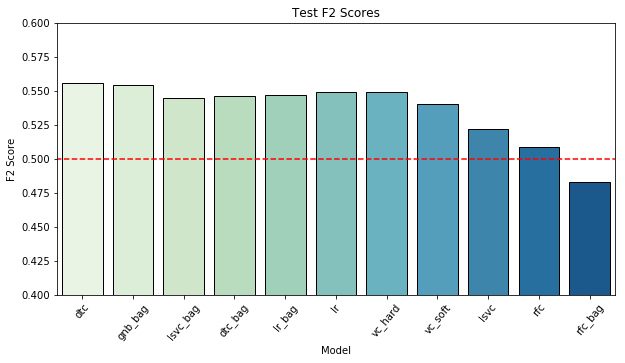
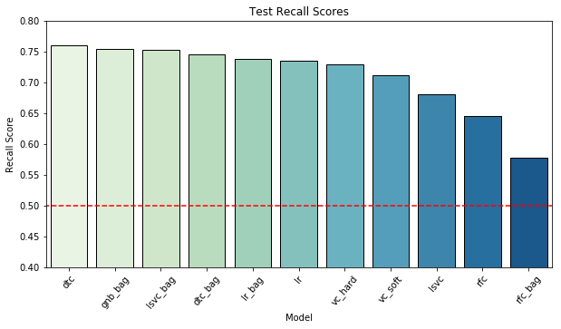
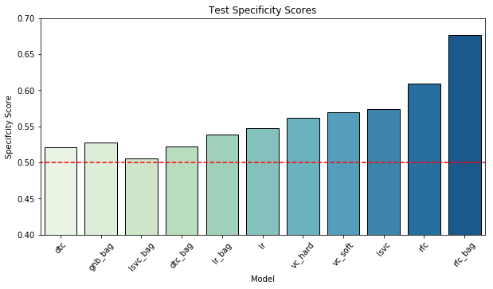

Surprisingly, the singular decision tree classifier is actually the strongest performer in terms of both F2 and recall scores. This was somewhat counter to what we had anticipated given the fixed random state of the tree increasing the likelihood of overfitting our train/validation set. If we consider the opposite end of the spectrum, both the random forest and bagged random forest classifiers performed significantly worse, and it is very possible that the fixed random state had a much more detrimental impact on the forest classifiers.

Another interesting note is that the bagged GNB classifier - which as a single classifier was one of the weakest models during initial model evaluation - is our second-best performing model. Additionally, it manages to achieve almost identical recall and F2 scores as our decision tree classifier (differences on the magnitude of 0.01) with less of a cost to precision and specificity.

Proceeding with what is technically our best model in terms of our target metrics of recall and F2, the decision tree classifier produced the following results on the test data:

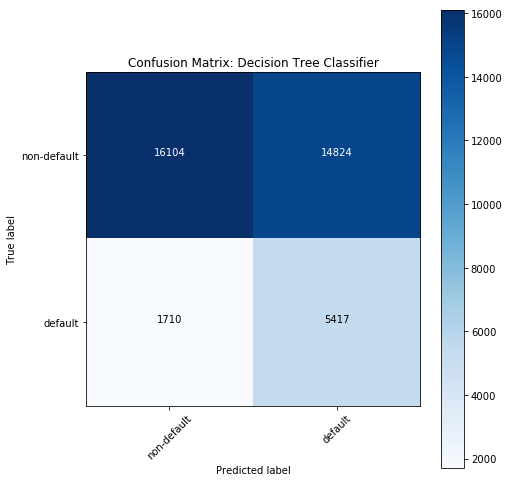

Discounting for the class imbalance, we can see that even with our lower precision/specificity, we are still left with a decent portion of true-negative non-default loans. This obviously is benefited by our utilization of a test set with 38k loans, but if we consider that our 180k loan applications used in this analysis are over the span of approximately 3 years, one could expect 150-200 loans to be evaluated per day. Thus, even with the large number of false-positives, we would hope to still leave investors with a pool of 70+ loans. Obviously, we are still left with a portion of unidentified default loans (false negatives), so some additional industry expertise may be required to vet these remaining loans. Even without any additional analysis, however, we have reduced the proportion of default to just over 10% from our original 20%, essentially reducing the risk of these investments by half.

While there is definitely still room for improvement and additional avenues to be explored in better modelling for this data, given the business context of this problem and the circumstances of our data (i.e. class imbalance), this is not a terrible solution for a first iteration. As far as the best performing decision tree classifier goes, there are still concerns as to how this model may perform long term due to the aforementioned risk of overfitting, but only time and additional data will be able to show how robust this solution actually is. If this does show itself to be a signficant issue, there are always our other top contending models such as the bagged GNB classifier, which demonstrated almost equal performance in recall scores. 

### Future Work & Research

The results achieved here are reasonable for a first iteration, however these models have all come with significant costs to precision and specificity as a result of prioritizing recall, and we have been unable to break past the range of identifying more than 75% of default loans. There are a few options worth exploring which may yield further improvement:

- Class Imabalance: As evident throughout this analysis, the class imbalance between default and non-default loans has been a source of problems on numerous occassions. For the most part, this imbalance was addressed via class weight parameters in each model, but models where this is not an option (i.e. KNN) were found to be unviable. An alternative solution to our class imbalance would be to perform undersampling or oversampling of the data to change the proportion of default loans. For example, the [imbalanced-learn](http://contrib.scikit-learn.org/imbalanced-learn/stable/index.html#) package could be utilized to boost the number of default loans.
- External Data: This analysis has focused solely on using the provided dataset. Naturally, this has constrained the available attribtes, potentially missing important factors for determining the likelhood of a loan defaulting. With scores achieved here, whilst there is the possibility of improving performance via other options listed here, it is entirely possible that we are reaching the limit of what insights this data can actually provide. As mentioned during initial data exploration, FICO credit scores were listed as part of this dataset but found to be missing - likely due to data privacy. Having access to these scores, along with other possible indicators pertaining to the borrower, economy, region & demographics, could all aid in breaking past a recall score of 0.75 without jeoardizing precision and specificity.
- Data Accuracy: As mentioned during initial data exploration, there is concern as to how accurate the provided data due to the possibility that loan data is continuously updated throughout the lifespan of a loan and a borrower being in the Lending Club system. Lending Club unfortunately provided little information as to how and when different values get updated, so for the purpose of this analysis we proceeded with the assumption that all values were representative of the loan at the time of instantiation. If this proves to be the case, however, the set of attributes used in our modelling will require drastic changes to eliminate future biased/invalidated data, since in the context of this busines problem of identifying investment opportunities we are only interested in modelling off loan data in its initial state.
- Ensemble Methods: As far as ensembles go, we only realy explored bagging and hard/soft voting classifiers. The extent to which these were optimized was also limited to the computational complexity of exhausting all possible combinations of models, weights, and parameters. Not only could potential improvement be made by exploring these further, but additional ensemble methods suck as stacking (e.g. via [mlxtend](https://rasbt.github.io/mlxtend/user_guide/classifier/StackingClassifier/)) have yet to be tested. It should be noted, however, that given the size of our dataset the time involved in extensively tuning these would be significant.
